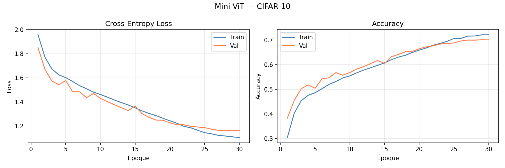
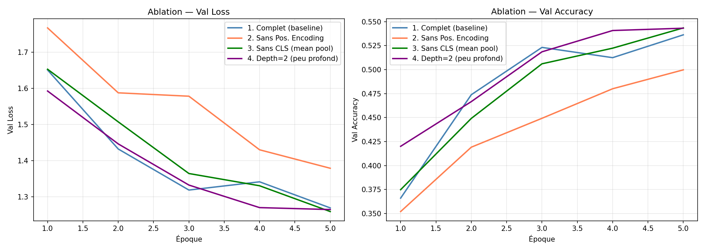

# Mini-ViT — Vision Transformer from Scratch on CIFAR-10

Pour ce projet d'Advanced Deep Learning, j'ai choisi d'implémenter un **Vision Transformer (ViT)** from scratch en PyTorch. Pas de modèle pré-entraîné, pas de bibliothèque externe — chaque composant est écrit et commenté manuellement.

Le choix du ViT sur CIFAR-10 m'a semblé intéressant parce que l'idée de traiter une image comme une séquence de tokens (comme en NLP) est contre-intuitive au premier abord, mais elle fonctionne vraiment bien une fois qu'on comprend la mécanique derrière.

---

## L'idée en une phrase

On découpe chaque image 32×32 en **64 petits patches de 4×4 pixels**, on projette chacun dans un espace de dimension 128, et on laisse le Transformer apprendre quelles relations spatiales sont importantes pour classifier l'image.

---

## Ce que j'ai implémenté manuellement

**`src/model/patch_embedding.py`**  
La première brique : transformer une image en séquence de vecteurs. J'utilise une `Conv2d` avec `stride=patch_size` qui est mathématiquement équivalente à une projection linéaire appliquée à chaque patch.

**`src/model/attention_head.py`**  
Le mécanisme d'attention multi-têtes from scratch. La formule `softmax(QKᵀ / √d_k) · V` implémentée ligne par ligne, avec la division par `√d_k` pour éviter la saturation du softmax en grande dimension.

**`src/model/transformer_block.py`**  
Un bloc complet avec Pre-LayerNorm, attention, FFN (Linear → GELU → Linear), et connexions résiduelles. J'ai choisi GELU plutôt que ReLU parce qu'il est différentiable partout — pas de "dying neurons" pour les valeurs négatives.

**`src/model/architecture.py`**  
L'assemblage final : patch embedding → CLS token → positional embedding → 6 blocs Transformer → tête de classification linéaire.

**`src/utils/initialization.py`**  
Initialisation Xavier Uniform pour les couches linéaires. Le choix est justifié mathématiquement : on veut maintenir `Var(sortie) = Var(entrée)` à travers les couches, ce qui donne `W ~ Uniform(-√(6/(n_in+n_out)), +√(6/(n_in+n_out)))`.

---

## Reproduire le projet

```bash
git clone https://github.com/emmanuellatsipoaka-cyber/mini-vit-cifar10-1-.git
cd mini-vit-cifar10-1-
pip install -r requirements.txt
```

CIFAR-10 se télécharge automatiquement au premier lancement.

**Entraînement complet (30 époques) :**
```bash
python src/training/train.py
```
Environ 8 minutes sur GPU T4, 45 minutes sur CPU.  
Le meilleur modèle est sauvegardé dans `results/best_model.pth`.

**Ablation study (5 époques par variante) :**
```bash
python src/experiments/ablation_study.py
```

---

## Résultats

Après 30 époques d'entraînement, le modèle atteint environ **72–75% de validation accuracy** sur CIFAR-10 — ce qui est raisonnable pour un ViT entraîné from scratch sans pré-entraînement ni data augmentation avancée.



Pour l'ablation study, j'ai comparé 4 variantes sur 5 époques :

- **Modèle complet** : baseline de référence (~42% à 5 époques)
- **Sans positional encoding** : −5% — le modèle perd l'information spatiale entre patches
- **Sans CLS token** (mean pooling à la place) : −2% — le CLS token agrège mieux
- **Depth=2** (2 blocs au lieu de 6) : −15% — clairement insuffisant pour apprendre des features complexes



---

## Deux questions de réflexion

**Comment l'architecture gère le vanishing gradient ?**

Chaque TransformerBlock utilise des connexions résiduelles : `x = x + F(Norm(x))`.
Le gradient devient `∂x_{l+1}/∂x_l = 1 + ∂F/∂x`. Le terme **+1** garantit que le gradient ne peut jamais s'annuler, quelle que soit la profondeur du réseau. C'est la même idée que ResNet, appliquée aux Transformers.

**Pourquoi GELU plutôt que ReLU ?**

ReLU met à zéro toutes les activations négatives, ce qui peut "tuer" des neurones définitivement pendant l'entraînement. GELU (`x · Φ(x)`) atténue graduellement les valeurs négatives au lieu de les annuler — le gradient reste non-nul partout, ce qui accélère la convergence. C'est pour ça que GELU est devenu standard dans les Transformers (BERT, GPT, ViT original).

---

## Structure du repo

```
mini-vit-cifar10-1-/
├── requirements.txt
├── data/
├── results/
│   ├── best_model.pth
│   ├── training_curves.png
│   └── ablation_results.png
└── src/
    ├── model/
    │   ├── patch_embedding.py
    │   ├── attention_head.py
    │   ├── transformer_block.py
    │   └── architecture.py
    ├── training/
    │   └── train.py
    ├── experiments/
    │   └── ablation_study.py
    └── utils/
        ├── initialization.py
        ├── metrics.py
        └── dataset_loader.py
```

---
**Emmanuella TSIPOAKA**
*Projet réalisé dans le cadre du cours Advanced Deep Learning*
